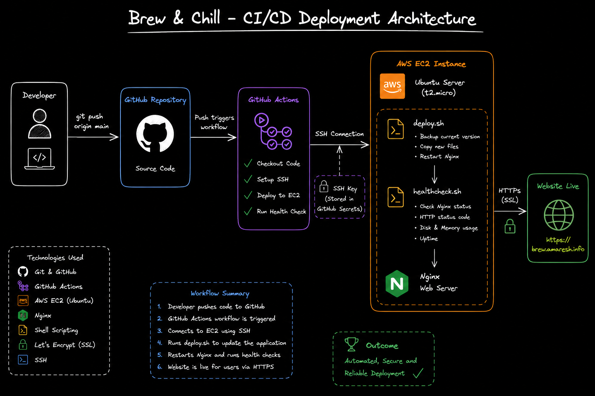
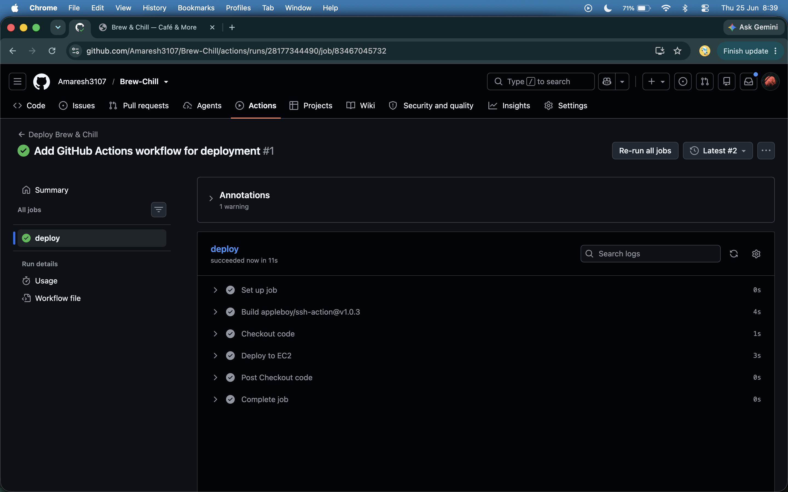
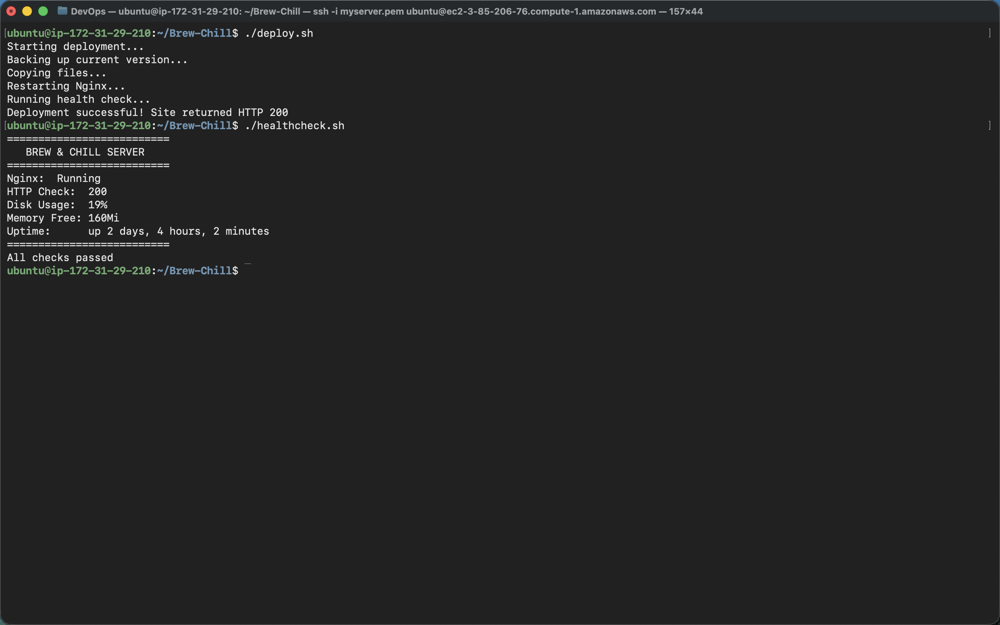

# ☕ Brew & Chill - Automated CI/CD Deployment

A DevOps project demonstrating an automated CI/CD pipeline for deploying a website to an AWS EC2 instance using **GitHub Actions**, **Nginx**, and **Shell Scripting**.

The pipeline automatically deploys the latest code whenever changes are pushed to the **main** branch.

---

## 🚀 Live Demo

**Website:** https://brew.amaresh.info

---

## 📌 Project Overview

This project demonstrates how a modern CI/CD pipeline can automate deployments without requiring manual intervention.

### Workflow

```text
Developer
    │
    ▼
GitHub Repository
    │
    ▼
GitHub Actions
    │
    ▼
SSH Authentication
    │
    ▼
AWS EC2 Instance
    │
    ▼
deploy.sh
    │
    ▼
Nginx Web Server
    │
    ▼
brew.amaresh.info
```

---

## 🛠️ Tech Stack

* Git
* GitHub
* GitHub Actions
* Linux (Ubuntu)
* Shell Scripting
* AWS EC2
* Nginx
* SSH
* Let's Encrypt SSL
* DNS (Custom Subdomain)

---

## ✨ Features

* Automated deployment on every push to the `main` branch
* Secure SSH authentication using SSH Keys
* Nginx web server configuration
* Custom domain deployment (`brew.amaresh.info`)
* HTTPS enabled using Let's Encrypt SSL
* Automated deployment script
* Automated health check script
* Zero manual file copying after initial setup

---

## 📂 Project Structure

```text
.
├── .github/
│   └── workflows/
│       └── deploy.yml
│
├── css/
├── js/
├── assets/
│
├── deploy.sh
├── healthcheck.sh
├── index.html
└── README.md
```

---

## ⚙️ CI/CD Pipeline

The deployment pipeline performs the following steps automatically:

1. Code is pushed to the `main` branch.
2. GitHub Actions workflow starts.
3. Repository is checked out.
4. GitHub connects securely to the EC2 instance using SSH.
5. Latest code is copied to the web server.
6. Nginx is restarted.
7. Health checks are executed.
8. Website is updated automatically.

---

## 📜 Deployment Script

The deployment script performs tasks such as:

* Creating backups
* Copying latest files
* Restarting Nginx
* Verifying HTTP response
* Printing deployment status

---

## ❤️ Health Check Script

The health check script validates:

* Nginx status
* HTTP Status Code
* Disk Usage
* Memory Usage
* Server Uptime

This ensures the deployment completed successfully.

---

## 🔐 Security

* SSH Key Authentication
* GitHub Secrets for sensitive credentials
* HTTPS using Let's Encrypt SSL
* Custom Domain Configuration
* Secure Nginx Configuration

---

## 📸 Screenshots

### Architecture


---

### GitHub Actions


---

### Deployment Output


---

### Live Website


---

## 🎯 Skills Demonstrated

* CI/CD
* GitHub Actions
* AWS EC2
* Linux Administration
* Shell Scripting
* SSH
* Nginx
* HTTPS & SSL
* DNS Management
* Automation

---

## 📈 Future Improvements

* Dockerize the application
* Add rollback support
* Integrate monitoring
* Add deployment notifications
* Configure Infrastructure as Code using Terraform
* Deploy using Kubernetes

---

## 👨‍💻 Author

**Amaresh Kumar**

GitHub: https://github.com/Amaresh3107

LinkedIn: https://www.linkedin.com/in/amaresh3107
